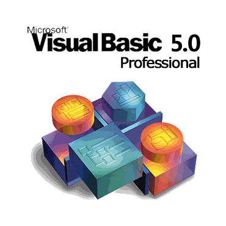
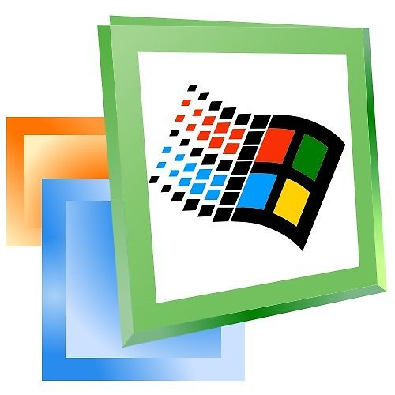
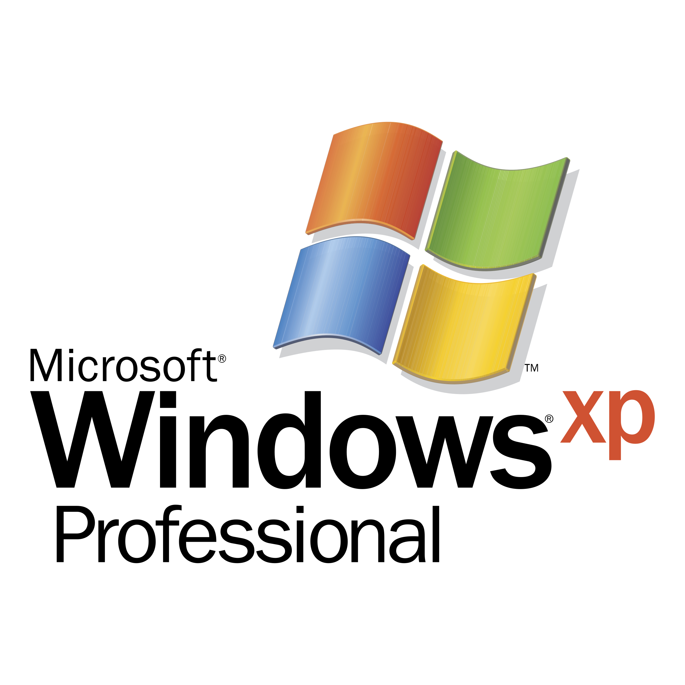

- 👋 Hi, I’m @Martingonn
- 👀 I’m interested in Python, C++, old operating systems, privacy
- 🌱 I’m currently learning C++ and making an antivirus for Windows XP
- 💞️ I’m looking to collaborate on Meteor Client addons
- 📫 Reach me martingonn.dev@outlook.com
- 😄 Pronouns: he/him
- ⚡ Fun fact: coding in Python since 2018!

  
  
  
  
  
  
  
  
  
  
  

 __Projects__

**Done**
 [Racoon-MC-Modpack-Installer](https://github.com/Martingonn/Raccoon-MC-Modpack-Installer) - downloads modpacks - [Done]    
 [Czechify](https://github.com/Martingonn/Czechify) - converts Polish into Czech digraphs - [Done]

**In development**  
 [Sentinel XP](https://github.com/Martingonn/SentinelXP) - antivirus for Windows XP - [In development]  

**Minor fixes to come**  
 [Minecraft Remote Console Password Cracker](https://github.com/Martingonn/MinecraftRCONpasswordCracker) - [Minor fixes to come]   

 [Windows XP Product Key Cracker](https://github.com/Martingonn/WindowsXP-Product-Key-Cracker) - [Minor fixes to come]  

**Needs new approach**  
 [Packrat Screen Recorder](https://github.com/Martingonn/PackratScreenRecorder) - Intended for Windows XP - [Needs entirely new approach]  

 [Multi-Vector-Attack-Toolkit](https://github.com/Martingonn/Multi-Vector-Attack-Toolkit) - a way to gain RCE on target - [Needs new approach, though not entirely]  

 [VID-to-SCR-Lib](https://github.com/Martingonn/VID-to-SCR-Lib) - Converts Videos to .Scr - [Needs entirely new approach]  

 [PythonYTDownloader](https://github.com/Martingonn/PythonYTDownloader) - Downloads YouTube videos - [Needs entirely new approach]   

**Additions to come**  
 [Dormouse Image Generator](https://github.com/Martingonn/Dormouse-ImageGen) - AI image generator in Python - [Additions to come]  

 [HTTP Website List](https://github.com/Martingonn/HTTP-List) - A list of HTTP websites - [Additions to come as I find more such websites]

 [Martin's Office 97 Presentations](https://github.com/Martingonn/MartinsOffice97Presentations) - A list of presentations made in Office 97 - [Additions to come]

**Untested**  
 [Sharemeal P2P Website](https://github.com/Martingonn/Sharemeal-P2P-Website) - allows for P2P website hosting - [Untested]  

 [InstanceSwarm](https://github.com/Martingonn/InstanceSwarm) - allows for many VMs to run on one host with one command - [Untested]

**Misc**

 [My presentations in Office 95 and 97](https://github.com/Martingonn/MartinsOldMSOfficePresentations/) - check them out, still adding some more in! - [Misc]

